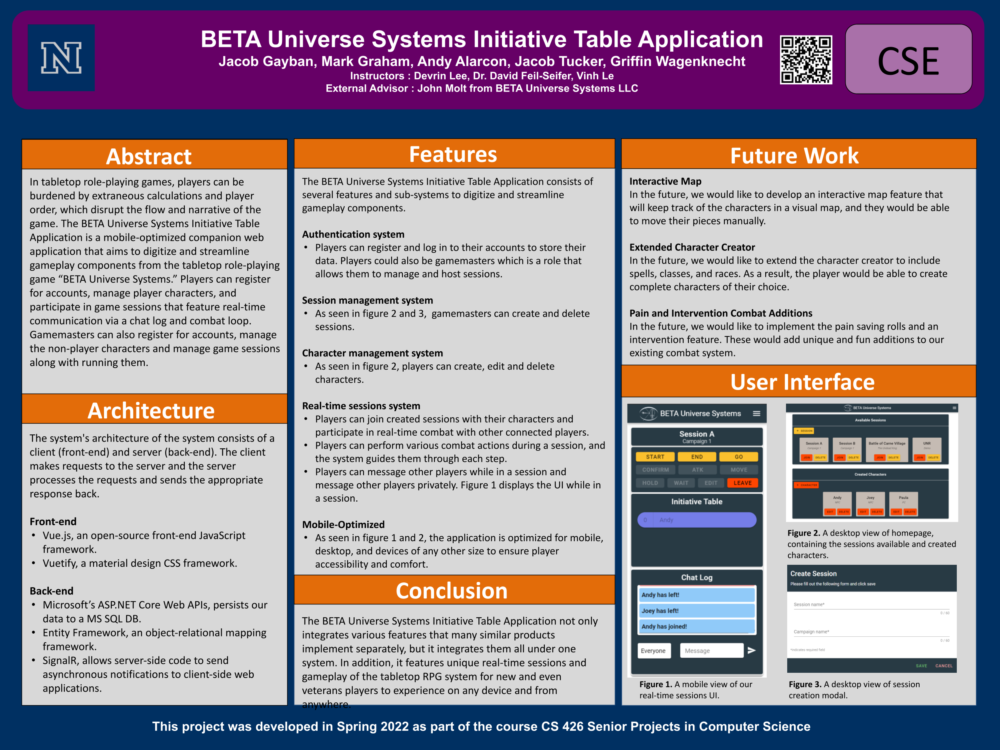

## About

In tabletop role-playing games, players can be burdened by extraneous calculations and player order, which disrupt the flow and narrative of the game. The BETA Universe Systems Initiative Table Application is a mobile-optimized companion web application that aims to digitize and streamline gameplay components from the tabletop role-playing game “BETA Universe Systems.” Players can register for accounts, manage player characters, and participate in game sessions that feature real-time communication via a chat log and combat loop. Gamemasters can also register for accounts, manage the non-player characters and manage game sessions along with running them.

## Team Members

Jacob Gayban, Mark Graham, Andy Alarcon, Jacob Tucker, Griffin Wagenknecht

## Advisors

### Instructors

Dave Feil-Seifer

Devrin Lee

Vinh Le

### External Advisor

John Molt, BETA Universe Systems LLC

## Project Poster

## Related Resources

### Problem Domain Book

John Molt. 2017. _Beta Universe Systems Book of Player Character Combat._  
This is the book that we are digitizing. It is our reference material that our advisor has written for his tabletop role-playing game. This book details every aspect of combat and everything that he wants us to automate. If we ever have a question we reference this book.

### Useful Websites

[Roll20](https://roll20.net/)  
This is a popular Dungeons and Dragons (D&D) companion that shows a map, plays music, and has a chat log. After our part of the project is done our advisor wants to add a virtual map and music. It is used in a group setting similar to our web app. It is used as a companion, but is not a supplement for the game.

[D&D Initiative Tracker](https://kastark.co.uk/rpgs/encounter-tracker/)  
This website is similar to our project. It is an initiative tracker where you manually enter your name, initiative number, and HP. This differs from our project in that ours automates all of combat and not just helps with the initiative order.

[D&D Beyond](https://www.dndbeyond.com/)  
This is a D&D reference website where you can store characters, books, classes, pretty much everything you need for D&D. We are aiming to make something like this, but for our role-playing system. Our project is step-one of our external advisor's plan.

### Technical Resources

Jean Yang, Vijay Janapa Reddi, Yuhao Zhu, and Peter Bailis. 2016. Research for Practice: Web Security and Mobile Web Computing: Expert-curated Guides to the Best of CS Research. _Queue_ 14, 4 (July-August 2016), 80–95. DOI: <https://doi.org/10.1145/2984629.3005356>

Thomas Gustafsson and Jörgen Hansson. 2004. Dynamic on-demand updating of data in real-time database systems. In _Proceedings of the 2004 ACM symposium on Applied computing_ (_SAC '04_). Association for Computing Machinery, New York, NY, USA, 846–853. DOI: <https://doi.org/10.1145/967900.968074>

### Other Sources

<!-- <object data="./assets/pdfs/426_PA1.pdf" width="740" height="1000" type='application/pdf'></object> -->

#### Links To Our Documentation

##### CS 425

[PA1](./assets/pdfs/425_PA1.pdf) [PA2](./assets/pdfs/425_PA2.pdf) [PA3](./assets/pdfs/425_PA3.pdf) [PA4](./assets/pdfs/425_PA4.pdf)

##### CS 426

[PA1](./assets/pdfs/426_PA1.pdf) [PA2](./assets/pdfs/426_PA2.pdf) [PA3](./assets/pdfs/426_PA3.pdf) [PA4](./assets/pdfs/426_PA4.pdf)
